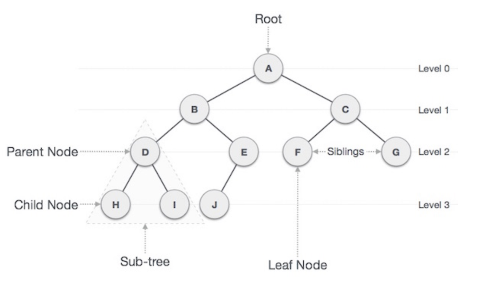
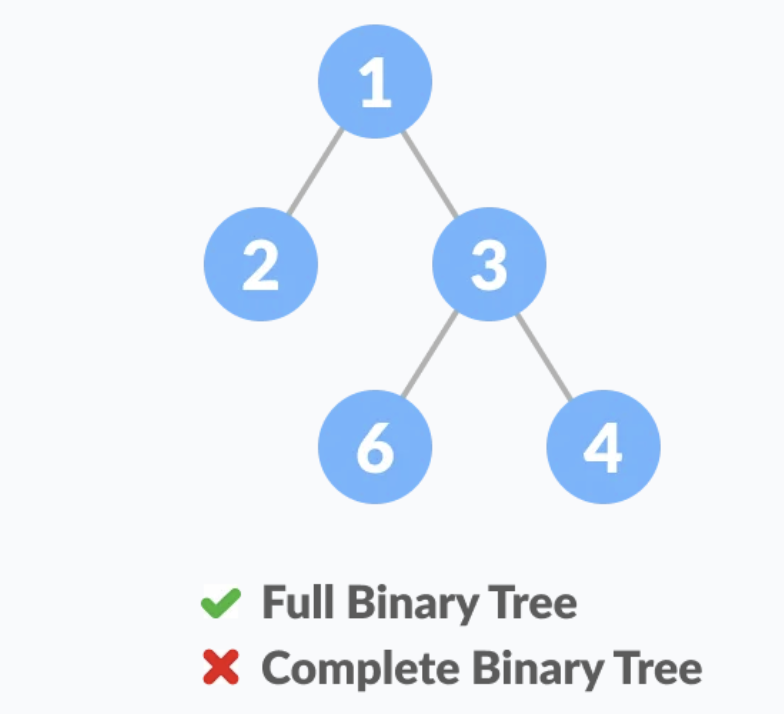
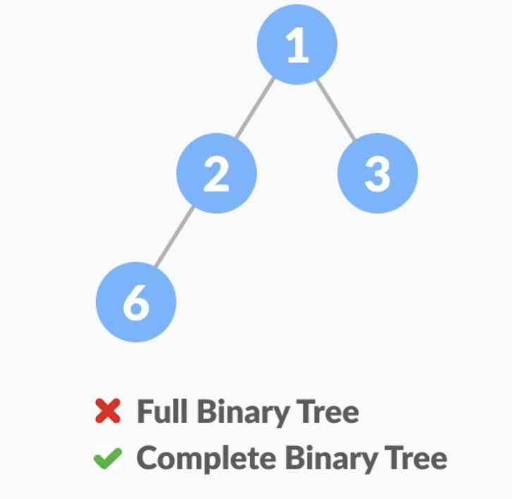
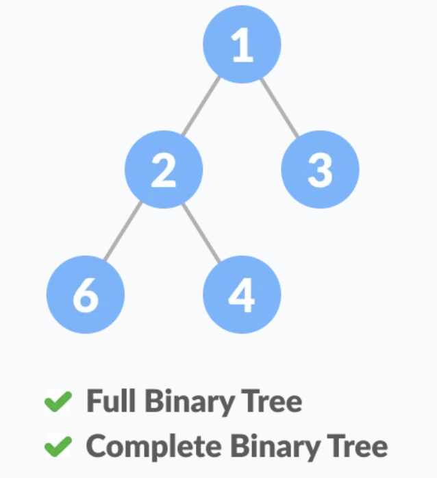

# Tree

What is a Tree data structure ?

- Non-linear and a hierarchical data structure.
- Consisting of a collection of nodes
- A way to represent and organize data
- Easy to navigate and search

The topmost node of the tree is called the root, and the nodes below it are called the child nodes.

Why Tree is considered a non-linear data structure ?

- Not stored in a sequential manner ( = Not stored linearly ).
- Instead, arranged on multiple level.



## Basic Terminologies in tree data structure :

- `**Parent Node**` : A predecessor of a node.
- `**Child Node**` : The immediate successor of a node.
- `**Root Node**` : The top most node of a tree or not have any parent node.
- `**Leaf Node or External Node**` : Not have any child nodes.
- `**Sibling**` : Children of the same parent node.
- `**Level of a node**` : The count of edges. Root node  has level 0.
- `**Internal node**` : A node with at least one child.
- `**Neighbour of a Node**` : Parent or child nodes.
- `**Subtree**` : Any node of the truee along with its descendant.

## Properties of a Tree :

- `**Number of edges**` : A tree has N nodes then it will have N-1 edges.
- `**Depth**` : The length of the path from the root to that node. ( Depth of D : 2 )
- `**Height of the Tree**` : The length of the longest path from the root of the tree to a leaf node of the tree. ( Height of A : 3 )
- `**Height of  a node**` : The length of the longest path from the node to a leaf node of the tree.
- `**Degree of a Node**` : The total count of subtrees attached to that node.

## Why to use Tree Data Structure ?

- To store data **hierarchically**.  ********(e.g the file system.)
- Moderate access & search ( quicker than Linked List and slower than Array )
- Moderate insertion & deletion ( quicker than Array and slower Linked List )

## Systax:

```jsx
struct Node {
	int data;
	struct Node *left_child;
	struct Node *right_child;
}; 
```

## Basic Operation of Tree:

- Create : Create a tree
- Insert : Insert data
- Search : Search specific data in a tree to check it is present of not.
- Preorder Traversal : Perform traveling a tree in a pre-order manner.
- In order Traversal : Perform traverling a tree in an in-order manner.
- Post order Traversal : Perform traverling a tree in a post-order manner.

## Traversal of Tree

Traversing a tree means visiting every node in the tree.

Linear data structures like array, stack, queue, and linked list have only one way to read the data. But a hierarchical data structure like a tree can be traversed in different ways.

### Inorder traversal

1. Visit all the nodes in the left subtree
2. Then the root node
3. Visit all the nodes in the right subtree

```jsx
inorder(root->left)
display(root->data)
inorder(root->right)
```

### Preorder traversal

1. Visit root node
2. Visit all the nodes in the left subtree
3. Visit all the nodes in the right subtree

```jsx
display(root->data)
preorder(root->left)
preorder(root->right)
```

### Postorder traversal

1. Visit all the nodes in the left subtree
2. Visit all the nodes in the right subtree
3. Visit the root node

```jsx
postorder(root->left)
postorder(root->right)
display(root->data)
```

## Types of Tree:

### Binary Tree

**Maximum number of children a node  can have is 2.**

A tree data structure in which each node has at most two children, which are referred to as the left child and the right child.

### Binary Search Tree

An ordered or sorted binary tree.

- Parent node greater than left node.
- Parent node smaller than right node.

### Balanced Binary Tree

### Balanced vs Unbalanced Binary Tree

- Balanced Tree is the height of the left and right subtree of any node differ by not more than 1.
- The distance between each node and the root is approximately the same.
- The distance constraint ensures that is takes the save amount of time to reach any leaf node in a binary tree from the root.

### Complete Binary Tree vs Full Binary Tree

Two major differences

1. All the leaf elements must lean towards the left.
2. The last leaf element might not have a right sibling.







# References

[ Tree Traversal ] https://www.programiz.com/dsa/tree-traversal

[ Tree ] https://m.blog.naver.com/rlakk11/60159303809

[ Tree - 2 ] https://yoongrammer.tistory.com/68

[ Balanced vs Unbalanced tree ] https://github.com/enkidevs/curriculum/blob/master/comp-sci/data-structures-and-algorithms/binary-search-tree/balanced-vs-unbalanced-binary-trees.md

[ full and complete true ] https://velog.io/@seochan99/%ED%8F%AC%ED%99%94%EC%9D%B4%EC%A7%84%ED%8A%B8%EB%A6%AC-%EC%99%84%EC%A0%84%EC%9D%B4%EC%A7%84%ED%8A%B8%EB%A6%AC-%EC%B0%A8%EC%9D%B4%EB%8A%94-%EB%AD%98%EA%B9%8C