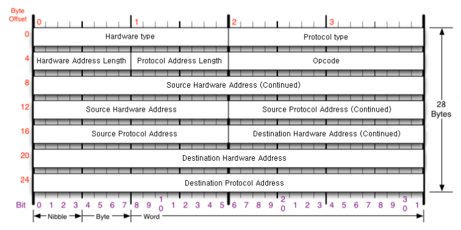

# ARP

## Dictionary Definition

`주소 결정 프로토콜(Address Resolution Protocol, ARP)은 네트워크 상에서 IP 주소를 물리적 네트워크 주소로 대응시키기 위해 사용되는 프로토콜이다. 
여기서 물리적 네트워크 주소는 이더넷 또는 토큰링의 48 비트 네트워크 카드 주소를 뜻함.`

**IP 주소를 MAC 주소와 매칭 시키기 위한 프로토콜.**

ARP를 사용하는 이유는 **LAN에서 단말과 단말 간 통신을 하기 위해서는 IP주소와 함께 MAC 주소를 이용하게 되는데, IP 주소를 MAC 주소와 매칭하여 목적지 IP의 단말이 소유한 MAC 주소를 향해 제대로 찾아가기 위함**.

IP 주소를 MAC 주소로 매칭하는 이유는 실제 단말의 주소로 찾아가기 위함.

IP 주소와 MAC 주소를 일대일 대응하여 테이블로 정리하고 목적지 IP에 맞는 목적지 MAC 주소로 전달.

이 테이블은 **ARP Table**.

`ARP Table : IP 주소와 MAC 주소를 일대일 매칭시킨 정보를 정리해둔 테이블.`

## LAN ( Local Address Network )

근거리 통신망, 로컬 영역 네트워크 ( Local Area Network ), 구내 정보 통신망은 네트워크 매체를 이용하여 집, 사무실, 학교 등의 건물과 같은 가까운 지역을 한데 묶는 컴퓨터 네트워크.

**ARP Request가 미치는 영역.**

아무리 큰 규모의 네트워크일지라도 같은 IP 대역을 공유한다면 그것은 근거리 네트워크.

ARP Request Packet이 전달되기만 한다면 LAN이라고 보는 것.

같은 IP 대역을 공유하는 LAN에서 단말 간 통신을 하기 위해, 다시 말해 Layer 2에서의 통신에서 사용자는 IP 주소를 목적지로 지정하지만 실제로 MAC 주소를 이용해 목적지를 찾음. 이에 IP 주소와 MAC 주소를 매칭하기 위해 ARP가 사용된다는 의미.

## MAC address

데이터 링크 계층에서 통신을 위한 네트워크 인터페이스에 할당된 고유 식별자로 NIC를 가진 단말이라면 공장에서 출고될 때 부여되고 평생 사용하는 고유한 주소를 의미.

LAN에서 목적지와 통신하기 위한 실질적인 주소가 바로 **MAC 주소**.

이 MAC address는 로컬하게 사용됨.

이 의미는 L2 계층의 주소는 한 네트워크 상에서만 유효하다는 것.

### 데이터 링크 계층
장치 간 신호를 전달하는 물리 계층을 이용하여 네트워크 상의 주변 장치들 간 데이터를 전송.

데이터 링크 계층의 두 가지 주요 기능
1. 주소 할당

물리 계층으로부터 받은 신호들이 네트워크 상의 장치에 올바르게 안착할 수 있게 함.

2. 오류 감지

신호가 전달되는 동안 오류가 포함되는지를 감지.

오류가 감지되면 데이터 링크 계층은 해당 데이터를 폐기.`

### Why need MAC address ?

IP 주소는 끊임없이 변화.

사람을 찾는 것으로 비유해본다면 이름은 IP 주소이고 주민등록번호는 MAC 주소인셈.

그렇다면 MAC 주소만 사용하면 되지 않나 ?

인터넷 상에서 MAC 주소를 이용하여 라우팅을 한다면 각 고유한 주소를 라우팅 테이블에 일일이 일력하다간 라우터가 다운될 것. 숫자가 많아질테니까.

IP 주소는 연속성을 갖기 때문에 IP 주소 다수를 한 줄로 해줄 수 있으니 편리함.

## 기능

ARP 프로토콜은 기본적으로 목적지 호스트의 하드웨어 주소를 알아내는 것.

ARP 프로세스는 브로드캐스트를 기반으로 하는 특성으로 인해 발생하는 네트워크의 부하를 방지하기 위하여 다음의 기능을 제공.

### 1. ARP Cache

ARP Request를 통하여 얻은 하드웨어 주소는 다음에 또 사용할 가능성이 있으므로 ARP Cache Table에 일정 시간 동안 저장.

다음에 데이터를 보낼 때 ARP Cache를 확인함. 이로 인해 브로드캐스트가 줄어 네트워크의 성능이 향상됨.

- 왜 ARP Cache Table에 일정 시간동안 저장할까 ? 더 짧거나 길게 설정하면 ?

  [ 짧게 설정되는 경우 ]

  설정 값이 짧으면 네트워크의 호스트들은 지속적으로 ARP Cache Table의 Entry를 교체하게 되고 이로써 많은 브로드캐스트를 전송하게 되며 네트워크 성능 저하.

  [ 길게 설정되는 경우 ]

  어떤 호스트에 다른 IP 주소가 할당될 때 마다 ARP Cache Table에 이전의 하드웨어 주소가 남아 있어서 문제를 일으킴.

  [ 결론 ]

  일정 시간동안 저장하게 되는 이유는 IP 주소와 하드웨어 주소의 바인딩 정보가 변경되었을 경우 기존의 ARP Cache Table에 저장된 정보로 통신을 하게 될 경우 통신이 되지 않는 상황이 발생.

  그러므로  ARP Cache Table에 저장된 엔트리는 일정 시간이 지나게 되면 지워짐. 이것을 Life Time이라고 함.

### 2. ARP Refinement

다른 호스트들의 ARP Request에 담겨 있는 호스트의 IP와 MAC address를 참조하여 자신의 ARP Cache Table에 저장하는 방법.

ARP Request 메시지 안에는 Sender의 IP와 MAC address가 들어있으므로 ARP Request 메시지를 받은 모든 호스트는 Sender의 IP와 MAC address를 저장하게 된다. 이렇게 되면 다음 번에 데이터를 보낼 때 브로드 캐스트의 횟수를 줄여 네트워크 성능을 향상시킬 수 있음.

### 3. Static Entry

ARP Cache Table에 고정으로 IP와 MAC address를 저장하는 방법.

이 방법은 ARP Cache Table에서 해당 Entry는 Life Time이 존재하지 않지만, 시스템이 자주 이전되거나 시스템의 주소가 자주 변경되면 관리하기 어려운 단점이 존재.

**거의 쓰이지 않는 방법이라고 함.**

## ARP Process

1. 출발지와 목적지의 호스트가 같은 네트워크 상에 존재하는지 확인 ( Subnet Mask를 통해 )
2. 같은 네트워크라면 ARP Cache Table에서 목적지 호스트 MAC address가 존재하는지 확인. ( 1 - ARP Cache is Checked )
    1. 존재한다면 : 해당 MAC address를 사용
    2. 존재하지 않는다면 : APR Process를 진행 (  ⇒ 3 )
3. 네트워크 상에 브로드캐스트로 ARP Request 메시지를 전파 ( 2 - ARP Request is Sent )
4. 네트워크에 존재하는 모든 호스트는 ARP Request를 받고 자신의 ARP Cache Table에 엔트리 추가. ( 3 - ARP Entry is Added )
5. ARP Request를 받은 목적지 호스트는 MAC address를 유니캐스트로 ARP Reply 메시지 응답. ( 4 - ARP Reply is Sent )
6. ARP Reply 메시지를 받은 출발지 호스트는 목적지 호스트의 정보를 ARP Cache Table에 추가. ( 5 - ARP Entry is Added )
7. ARP Process는 종료되고, 프레임이 목적지 호스트로 전송됨 ( 6 - IP Packet is Sent )

- 출발지 호스트와 목적지 호스트가 동일한 네트워크 상에 존재하지 않는다면 ?

  출발지 호스트는 Default Gateway의 MAC address를 알아내서 네트워크 밖으로 전송.

  그 다음, Router가 프레임을 목적지 호스트로 전송.

- 왜 ARP Reply는 유니캐스트로 ?

  MAC address를 알고 있는 상태로 브로드캐스트로 전파 시 네트워크 대역폭을 차지한다면 네트워크 성능만 저하될 뿐.

## ARP Header

- Hardware type (HTYPE)
    - 요청된 하드웨어 주소의 종류 ( 네트워크 유형 )
    - 일반적으로 Ethernet 환경은 0x0001으로 설정.
- Protocol type (PTYPE)
    - 사용되는 상위 계층 프로토콜을 나타내는 필드 ( 프로토콜 정의 )
    - IPv4의 경우 0x0800으로 설정.
    - IP 에만 결속된 것은 아니며, MAC address를 찾고자 하는 모든 상위 계층 프로토콜에 의해 사용.
- Hardware address length
    - Source 및 Destination Hardware address 길이를 나타냄.
- Protocol address length
    - Source 및 Destination Protocol address의 상위 계층 프로토콜 주소의 길이를 나타냄.
    - 하드웨어 주소를 요청한 상위 계층 프로토콜이 IP일 경우 이 값은 4byte로 고정.
- Operation code
    - ARP 패킷의 목적을 나타냄 ( Request or Reply )
    - Request : 1
    - Reply : 2
- Source Hardware address
    - ARP 패킷을 전송하는 시스템의 하드웨어 주소.
    - 보통 Ethernet을 사용하므로 48bit.
- Source Protocol address
    - ARP 패킷을 전송하는 시스템의 상위 계층 프로토콜 주소.
    - 보통 IP를 사용하므로 32bit
- Destination hardware address
    - ARP 패킷을 받는 시스템의 하드웨어 주소
    - ARP Request라면 00:00:00:00:00:00으로 채워질 것.
    - 보통 Ethernet을 사용하므로 48bit
- Destination protocol address
    - APR 패킷을 받는 시스템의 상위 계층 프로토콜의 주소.
    - 보통 IP를 사용하므로 32bit

# References

[ ARP ] https://aws-hyoh.tistory.com/70

[ ARP ( 2 ) ] https://cafe.naver.com/neteg/3101

[ ARP Header ] https://nirsa.tistory.com/27