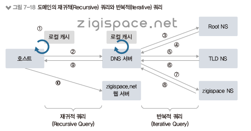

# DNS 동작 방식

# DNS 동작 방식

도메인을 IP 주소로 변환하려면 도메인 쿼리하는 과정을 거쳐야 함.

도메인 쿼리는 로컬과 DNS 서버를 탐색함.

로컬은 도메인과 IP 주소를 관리하는 hosts파일에 직접 설정 가능.

hosts 파일에 설정해두면 항상 DNS 캐시에 저장됨.

도메인 쿼리하는 과정은 DNS 서버에 쿼리를 하기 전 로컬에 있는 DNS 캐시 정보를 먼저 확인.

DNS 캐시는 동일한 도메인을 매번 질의하지 않고 캐시를 통해 성을 향상 목적.

이런 DNS 캐시 정보는 기존 DNS 조회를 통해 확인한 동적 DNS 캐시와 함께 hosts 파일에 저장되어 있는 정적 DNS 캐시가 함께 저장.

DNS 캐시 정보에 필요한 도메인 정보가 없으면 DNS 서버로 쿼리를 수행하고 DNS 서버로부터 응답을 받으면 그 정보를 캐시에 먼저 저장.

## Recursive Query

쿼리를 보낸 클라이언트에 서버가 최종 결과값을 반환하는 서버 중심 쿼리

클라이언트와 로컬 DNS 간에서 사용.

## Iterative Query

최종값을 받을 때까지 클라이언트에서 쿼리를 계속 진행하는 쿼리

로컬 DNS 서버와 상위 DNS 구간에서 사용.

이때 로컬 DNS는 클라이언트로 동작해 상위 DNS에 반복적으로 쿼리

1. 호스트는 해당 도메인 주소의 IP 주소가 로컬 캐시에 저장되어 있는지 확인.
2. 로컬 캐시에 저장되어 있지 않으면 호스트에 설정된 DNS 서버에 도메인 쿼리.
3. DNS 서버는 해당 도메인이 로컬 캐시와 자체에 설정되어 있는지 확인하고, 없으면 해당 도메인을 찾기 위해 루트 NS에 해당 도메인의 TLD 정보를 가진 도메인 주소를 쿼리.
4. 루트 DNS 는 해당 도메인의 TLD를 관리하는 TLD NS 정보를 DNS 서버에 응답.
5. DNS 서버는 TLD NS에 해당 도메인을 다시 쿼리.
6. TLD NS는 해당 도메인 정보를 가진 NS에 대한 정보를 DNS 서버로 응답.
7. DNS는 해당 도메인 정보를 가진 NS에 해당 도메인을 쿼리.
8. 해당 NS는 해당 도메인 정보를 DNS 서버에 응답.
9. DNS 서버는 해당 도메인 정보를 로컬 캐시에 저장하고 호스트에 정보를 응답.
10. 호스트는 DNS 서버로부터 받은 해당 도메인의 IP 주소를 이용해 사이트에 접속.

# References

[ DNS 동작 방식 ] https://cafe.naver.com/neteg?iframe_url_utf8=%2FArticleRead.nhn%253Fclubid%3D10344409%2526page%3D1%2526menuid%3D422%2526boardtype%3DL%2526articleid%3D232613%2526referrerAllArticles%3Dfalse