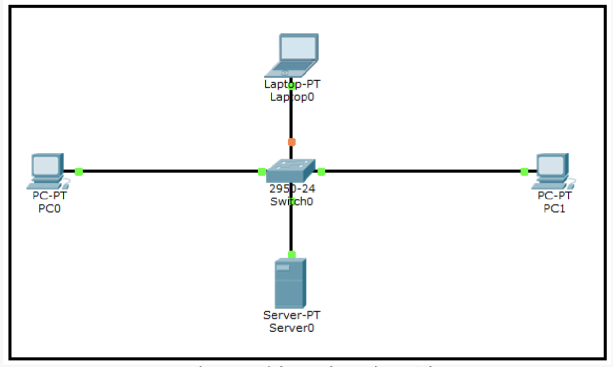

# LAN

동일한 IP 대역과 동일한 Subnet Mask를 사용하며 ARP Request Packet이 미치는 범위의 네트워크.

L2 Switch와 Hub만으로 연결된 네트워크는 하나의 LAN.

L2 Switch를 아무리 많이 연결해도 하나의 LAN.

Router의 각 interface는 각각 서로 다른 LAN을 구성.

## LAN 통신 과정

1. PC0에서 통신할 상대방 PC1의 IP 주소를 알아냄
2. PC1과 통신하기 위해서 메시지를 전송
3. Routing Table에서 PC1의 IP 주소로 가려면 어떤 interface로 나가야 하고, next hop IP가 무엇인지 찾음.
4. Next hop IP의 MAC address가 ARP Table에 등록되어 있는지 찾음.
5. ARP Table에 Next hop IP의 MAC address가 없다면 MAC address를 알아오기 위해서 ARP request 메시지를 전송.
6. Switch는 ARP request 메시지를 수신하면 source MAC address를 보고, PC0의 MAC Table entry를 만듬.
    1. PC0의 MAC address와 Frame이 수신된 port 번호를 MAC Table에 기록
7. Switch는 ARP request 메시지를 모든 LAN port로 브로드캐스트. ARP 패킷은 LAN 구간 끝까지 어디든 지 날라감.
8. ARP request를 수신한 PC1은 자신의 ARP Table에 PC0의 IP와 MAC address를 등록하고 ARP reply 메시지를 전송
    1. PC1의 ARP Table에는 ARP request 메시지를 받으면서 이미 PC0의 MAC address가 등록되어 있음
9. Switch는 ARP reply 메시지를 수신하면, source MAC address를 보고, PC1의 MAC Table entry를 만듬
10. PC0은 ARP reply 메시지를 수신하면, ARP Table에 PC1의 IP와 MAC address를 등록하고, PC1으로 전송되어야 할 패킷의 Destination MAC에 PC1의 MAC address를 부착하고 메시지를 전송.
11. Switch는 PC0가 전송한 Ethernet Frame을 수신하면, Destination MAC address가 MAC Table에 존재하는지 찾음
12. Switch는 MAC Table에 PC1의 정보가 등록되어 있으므로 PC1이 연결되어 있는 port로 메시지를 전송(Unicast).
13. PC1은 Destination MAC address가 자신의 NIC MAC address와 동일하므로 메시지를 수신하여 IP Layer로 전달하고, IP Layer에는 Destination IP가 자신의 IP와 동일하므로 IP 패킷을 수신.

TCP / IP 네트워크 통신을 이해하려면 Routing Table, ARP Table, MAC Table을 알면 됨.

PC 통신을 정리해보자면 :

Routing Table에서 상대 PC IP에 대한 next hop을 찾고, ARP Table에 next hop에 대한 MAC address가 등록 되어 있는지 보고, 등록되어 있지 않으면 ARP request 메시지를 보내서 MAC addres를 알아옴. Switch는 ARP request 메시지를 받으면 MAC learning을 해서 MAC Table을 만들고, ARP request 패킷을 모든 Switch port로 전부 브로드캐스트. 상대 PC에서 ARP reply를 보내면, Switch는 다시 MAC Table에 entry를 만들고, ARP reply 메시지를 수신한 PC는 ARP Table에 상대 PC MAC address를 등록하고, 메시지를 송신하게 됨. Switch에는 이미 상대 PC MAC address가 MAC Table에 등록되어 있어서 Switch는 상대 PC가 연결되어 있는 port로 메시지를 전송.

# References

[ LAN - 오리뎅이 ] https://blog.naver.com/goduck2/220111709554

[ LAN 쉽게 이해하기 ] [https://aws-hyoh.tistory.com/entry/LAN-쉽게-이해하기](https://aws-hyoh.tistory.com/entry/LAN-%EC%89%BD%EA%B2%8C-%EC%9D%B4%ED%95%B4%ED%95%98%EA%B8%B0)