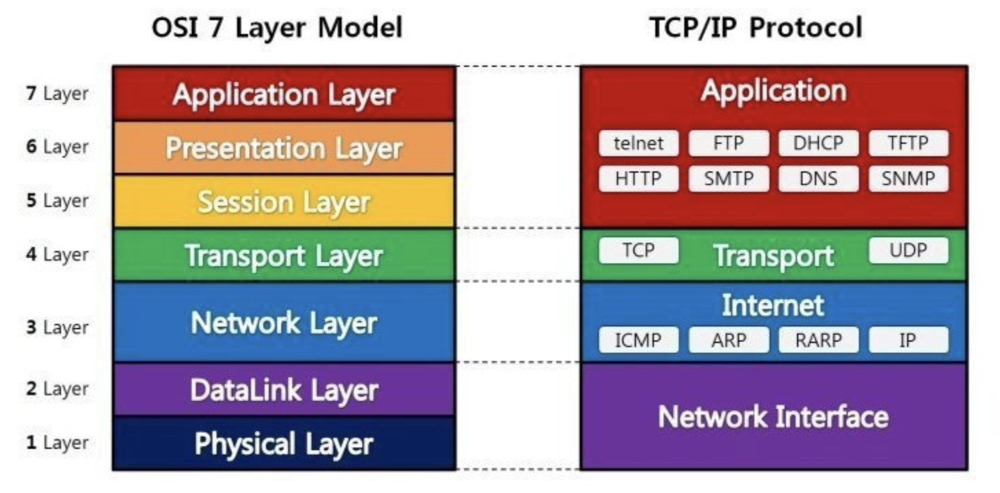

# OSI 7 Layer

## Dictionary definition

<aside>
국제 표준화 기구에서 개발한 모델로, 컴퓨터 네트워크 프로토콜 디자인과 통신을 계층으로 나누어 설명한 것. 해당 모델은 프로토콜을 기능별로 나눈 것.
각 계층은 하위 계층의 기능만을 이용하고, 상위 계층에게 기능을 제공함.
’프로토콜 스택’ 혹은 ‘스택’은 이러한 계층들로 구성되는 프로토콜 시스템이 구현된 시스템을 가리키는데, 프로토콜 스택은 하드웨어나 소프트웨어 혹은 둘의 혼합으로 구현될 수 있음.

</aside>

네트워크 통신 시 송신자와 수신자가 지켜야 할 각 단계의 규칙을 뜻함.

아래로 내려갈수록 Protocol Header가 추가되어 계층 정보를 덧붙임.

**계층을 나눈 이유는 장애 발생 시 어느 구간이 발생하였는지 보다 명확하게 알기 위함.**

## Application Layer ( 7 Layer )

사용자가 UI로 접하는 응용 프로그램과 관련된 계층.

여기에 속한 프로토콜들은 어떠한 방법으로든 사용자와 직접 접하게 됨.

`Data + HTTP Header`

## Transport Layer ( 4 Layer )

송신자와 수신자의 논리적 연결을 담당하는 부분으로 신뢰성 있는 연결을 유지할 수 있도록 도와줌.

즉 Endpoint 간의 연결을 생성하고 데이터를 얼마나 보냈는지, 얼마나 받았는지, 제대로 받았는지 등을 확인.

`Data + HTTP Header + TCP Header`

## Network Layer ( 3 Layer )

IP가 활용되는 부분으로, 한 Endpoint가 다른 Endpoint로 가고자 할 경우, 경로와 목적지를 찾아줌.

이를 Routing이라고 하며, 대역이 다른 IP들이 목적지를 향해 제대로 찾아갈 수 있도록 돕는 역할.

`Data + HTTP Header + TCP Header + IP Header`

## DataLink Layer ( 2 Layer )

같은 네트워크 대역을 사용하는 단말들에 대해 신뢰성 있는 전송을 보장.

MAC address를 활용하여 같은 구간 내의 Endpoint 혹은 Switch에 전달하며, 1 Layer에 해당하는 물리 계층에 생길 수 있는 오류를 찾아냄.

`Data + HTTP Header + TCP Header + IP Header + Ethernetframe Header`

### L2 switch

Layer 2 통신에서, 스위치는 전송받은 프레임을 어디로 보내야 하는지 알아야함.

그렇게 하기 위해서는 Switch Table 또는 MAC address Table을 확인함.

1. 전송해야 하는 목적지가 테이블에 있는 경우 그 경로로 프레임을 보냄.
2. 만약 테이블에 목적지가 없는 경우, 모든 포트에 그 프레임을 전송시킴. ( Flooding )
3. 도착직에 도착 후, 도착지의 장치가 자신의 MAC address를 테이블로 전송함. ( Reply )
4. 해당되는 장치의 MAC address를 테이블에 저장시킴
5. 다음부터 프레임이 위 장치가 목적지인 경우, 테이블을 참고하여 프레임을 전송

## Physical Layer ( 1 Layer )

Cable롤 대표되는 물리적인 계층으로 전기적 신호가 전송되는 구간.

# References

[ OSI 7 Layer ] https://aws-hyoh.tistory.com/50

[ DataLink Layer ] [https://ko.wikipedia.org/wiki/데이터_링크_계층](https://ko.wikipedia.org/wiki/%EB%8D%B0%EC%9D%B4%ED%84%B0_%EB%A7%81%ED%81%AC_%EA%B3%84%EC%B8%B5)