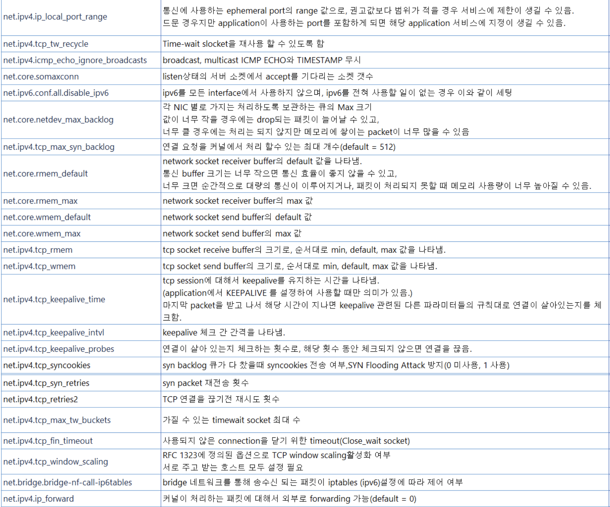

# sysctl

## Synopsis

```bash
$ sysctl [options] [variable=value]] [....]

$ sysctl -p [*file* or *regexp]* [....]
```

## Description

- 커널 파라미터를 수정하는 역할
- 사용 가능한 파라미터의 위치는 `/proc/sys` 아래에 있다.

## Why using?

- 시스템 성능 향상
- 보안 강화


 관련 디렉터리 - `kernel` , `fs` , `net` , `vm`

| kernel | IPC와 관련된 Internal Message Queue, Semaphore 등 설정하는 파라미터 |
|--------|--------------------------------------------------------|
| fs     | 파일 시스템 관련 파라미터                                         |
| net    | TCP, ICMP 등 네트워크 관련 파라미터                               |
| vm     | 메모리 관련 매개변수                                            |


## System file precedence

- `-- system` 옵션을 사용하면 sysctl은 아래의 디렉토리 순서대로 파일을 위에서 아래로 읽음.
    - `/etc/sysctl.d/*.conf`
    - `/run/sysctl.d/*.conf`
    - `/usr/local/lib/sysctl.d/*.conf`
    - `/usr/lib/sysctl.d/*.conf`
    - `/etc/sysctl.conf`

## Difference `-p` and `--system`

/etc/sysctl.conf 이외 다른 경로에 설정했다면 `-- system` 옵션을 통해 적용해야 함.

## Net Parameters



## References

[ man-page sysctl ] https://man7.org/linux/man-pages/man8/sysctl.8.html#top_of_page

[ about sysctl ] [https://s-core.co.kr/post_os/커널-파라미터에-관하여/](https://s-core.co.kr/post_os/%EC%BB%A4%EB%84%90-%ED%8C%8C%EB%9D%BC%EB%AF%B8%ED%84%B0%EC%97%90-%EA%B4%80%ED%95%98%EC%97%AC/)

[ sysctl command ] https://meongj-devlog.tistory.com/90